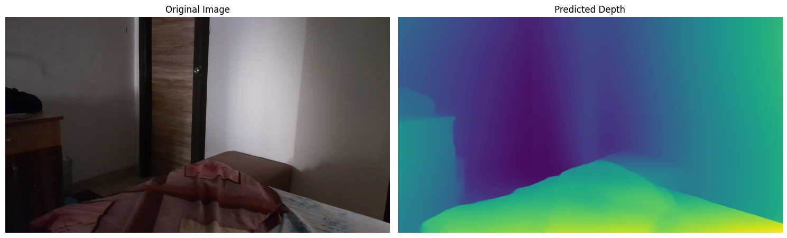

# Image/Video Depth Scan on Raspberry Pi

Hey, I'm starting this repository to explore image depth analysis using various models. The ultimate goal is to implement Visual SLAM on the robot I previously built. This space will serve as a sandbox for experimentation—where I'll test out different depth estimation models and work on automating the robot's navigation in new environments.

This repo will provide you a way to stream your Raspberry Pi's camera feed directly into a Google Colab or kaggle notebook. This allows you to leverage Colab's powerful GPUs for real-time image processing on a live video stream from your Pi.

### Here is the first image i tested it on (this photo was taken on my phone):

  

### How to get video stream from raspberry pi to the google colab or kaggle:

I have added 2 simple methods for streaming video to google colab and you can use either ngrok or cloudflare for streaming to your internet url. Python server + Cloudflare works well and gives around 30~ ms - 45 ms latency on average. But Mediamtx + Cloudflare or Ngrok gives even lower latency by streaming using webRTC and making a secure peer to peer conection. While using Mediamtx the Cloudfared and Ngrok are only required to make initial handshake.

Follow the setup for setting up the stream either by pyhton or mediamtx: [Stream Setup](./stream_setup/)

---